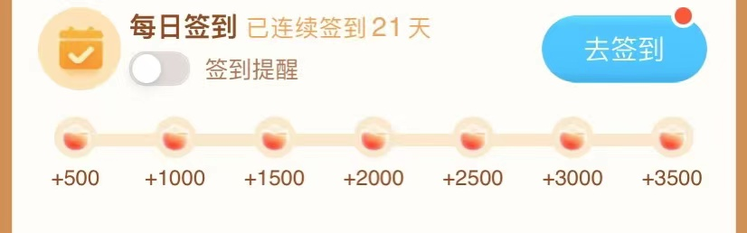
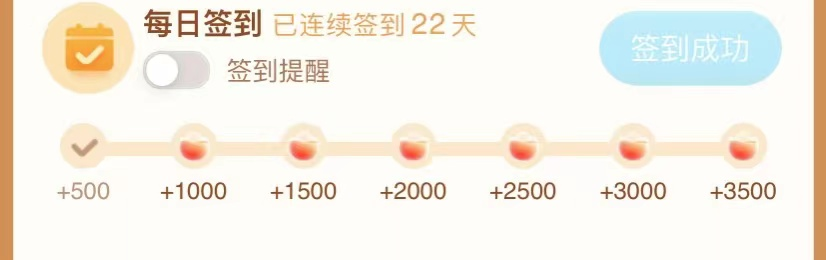
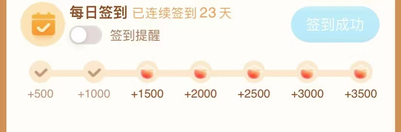

## 目录

| 内容                                                         |
| ------------------------------------------------------------ |
| [毕业项目文档](./README.md)|
| [毕业总结](./SUMMARY.md) |

## 命题要求

对当下自己项目中的业务，进行一个微服务改造，需要考虑如下技术点：

- 微服务架构（BFF、Service、Admin、Job、Task 分模块）

  具体体现在[服务分层](#服务分层)部分

- API 设计（包括 API 定义、错误码规范、Error 的使用）

  具体体现在[接口与错误定义](#接口与错误定义)部分

- gRPC 的使用

  具体体现在[业务代码结构](#业务代码结构)部分

- Go 项目工程化（项目结构、DI、代码分层、ORM 框架）

  具体体现在[业务代码结构](#业务代码结构)部分

- 并发的使用（errgroup 的并行链路请求）

  具体体现在[admin](#admin)部分

- 微服务中间件的使用（ELK、Opentracing、Prometheus、Kafka）

  只实现了Kafka中间件的使用.具体体现在[签到记录服务](签到记录服务(record-service)) , [reward-job](#reward-job)两部分

- 缓存的使用优化（一致性处理、Pipeline 优化）

  具体体现在[admin](#admin)的查询用户签到部分

## 项目需求

实现一个激励奖励系统，激励用户完成签到任务，从而增强用户活跃度。
包含以下内容

* 管理端
    * 查看指定用户的多天签到任务完成信息，实际中可应用于统计分析
* 一般用户
    * 注册与登录
    * 完成当天签到，查看签到状态
    * 查看钱包账户奖励余额
* 签到规则
    * 7天一个周期，签满7天自动切到下一个7天周期
    * 如果当天用户未完成签到，第二天签到周期重置到周期第一天
  
* 前端图片示例（copy过来的，感觉画不好:) )

> 首次获取签到信息



> 完成首次签到



> 完成第二次签到



## 框架使用

微服务框架

* kratos version v2.2.0

数据库部分

| 数据库    | ORM                 |
| --------- | ------------------- |
| mysql 8.0.26| entgo.io/ent v0.10.1 |

中间件部分

| 数据库       | SDK                       |
| ------------ | ------------------------- |
| redis 6.2.6  | go-redis/redis/v8 v8.11.4 |
| Kafka 2.8.1 | Shopify/sarama v1.32.0     |


## 项目结构

### 服务分层

针对[项目需求](#项目需求)，对项目进行以下分层

BFF

| 名称              | 描述                                        | 代码位置                                                     |
| ----------------- | ------------------------------------------- | ------------------------------------------------------------ |
| signin-interface | 普通用户BFF接口，提供http与grpc协议的接口   | 业务逻辑: /app/signin/interface<br>接口定义: /api/signin/interface/v1 |
| signin-admin     | 管理员用户BFF接口，提供http与grpc协议的接口 | 业务逻辑: /app/signin/admin<br/>接口定义: /api/signin/admin/v1 |


内部微服务

| 名称             | 描述                                                         | 代码位置                                                     |
| ---------------- | ------------------------------------------------------------ | ------------------------------------------------------------ |
| user-service     | 用户服务，管理用户信息，提供grpc协议的接口                   | 业务逻辑: /app/user/service<br/>接口定义: /api/user/v1       |
| record-service   | 签到信息记录服务，提供grpc协议的接口 | 业务逻辑: /app/record/service<br/>接口定义: /api/record/v1   |
| virtualwallet-service | 用户虚拟钱包账户，提供grpc协议的接口 | 业务逻辑: /app/virtualwallet/service<br/>接口定义: /api/virtualwallet/v1 |
| reward-job     | 异步发奖的接口，将用户签到后奖励写入钱包账户                 | 业务逻辑: /app/reward/job<br/>接口定义: /api/reward/job/v1 |


### 服务结构

参考了[beer-shop](https://github.com/go-kratos/beer-shop) 项目的实践形式


#### 接口与错误定义

使用proto buffer来定义接口与接口返回的错误，放置于`/api/<服务名称>/<服务类型>/<接口版本>`路径下，分别使用`*.proto`来定义接口信息和`*_error.proto`来定义错误信息

在定义好接口与错误信息后，使用`kratos proto client <protobuf文件路径>`来对proto buffer进行go文件转译

实际目录接口举例：

```bash
api/user/
└── v1
    ├── user_error_errors.pb.go
    ├── user_error.pb.go
    ├── user_error.proto
    ├── user_grpc.pb.go
    ├── user.pb.go
    └── user.proto
```


#### 业务代码结构

根据[kratos-layout](https://github.com/go-kratos/kratos-layout) 与 [beer-shop](https://github.com/go-kratos/beer-shop) 项目的最佳实践，每个服务会按以下分层

* cmd

  项目启动文件main.go

  构建依赖关系的wire.go，使用[google/wire](https://github.com/google/wire) 项目来实现项目启动时的依赖注入的生命周期管理

* configs

  采取yaml文件定义配置信息，如服务启动端口，数据库连接信息等

* internal/biz

  定于以下内容：

    1. 领域对象
    2. 服务用例
    3. 与外部数据源进行交互的组件的接口

* internal/conf

  使用proto buffer定义需要读取的配置信息的格式

* internal/data

  基于internal/biz定义的与外部数据源进行交互的组件的接口，实现具体的数据交互的逻辑

* internal/service

  基于1. internal/service中定义的服务用例， 2.[api](#接口与错误定义)中protobuf编译后的go文件接口，实现以下内容：

    * 处理与传递外部请求所发过来数据
    * 调用biz层中的服务用例来响应请求，并返回请求结果

* internal/server

    * 定义http与grpc服务对象的创建方法


#### 接口测试

每个服务的接口测试都定义在`test/<服务名>/<服务类型>/*_test.go`中


### 服务描述


#### 用户服务(user-service)

主要实现以下服务接口

* 通过ID批量查询用户信息

  从数据库中根据提交的id列表查询相印的用户信息

* 通过用户名获取该用户信息

  从数据库中根据提交的名字(精准匹配)获取用户信息，主要是用户登录时使用

* 根据用户名关键词搜索用户

  从数据库中根据提交的名字(模糊匹配)获取用户信息

* 持久化一个用户

  创建/更新用户信息到数据库中，用户注册时使用

* 移除一个用户

  标记数据库中的用户为删除状态(软删除)，管理员移除用户时使用


#### 签到记录服务(record-service)

主要实现以下服务接口

* 获取当前签到状态信息

  获取信息用于前端渲染，如是否签到，签到周期第几天

* 用户完成当天签到

    * 写入一条签到记录到数据库中
    * 作为消息队列生产者，给reward-job服务发送一条写入奖励信息到用户钱包的任务

  kafka生产者实现代码如下，代码位置是[app/record/service/internal/data/record.go](./app/record/service/internal/data/record.go)

* 获取用户签到记录，供admin接口使用

#### 发奖服务


##### reward-job

实现消息队列的消费者，监听record-service发送的消息，并且根据消息内容，调用virtualwallet服务，写入奖励信息

kafka的消费者队列实现如下，代码位置是[app/reward/job/internal/data/reward.go](./app/reward/job/internal/data/reward.go)


##### wallet-service

主要实现以下服务接口

* 查询用户账户余额
* 账户支付扣款，本次场景没有用到，保留接口
* 充值，即奖励到账

#### BFF

##### interface

主要实现以下服务接口(http)

* 用户登录

  提交用户名和密码到user-service中进行查询，若用户名匹配成功且密码正确，会根据用户id和用户名生成一个token并返回给客户端，其余接口需要在http请求头中获取Authorization字段中的token，进行解密后，将用户id写入context中才可进入业务逻辑，否则将中断请求

* 用户注册

  调用user-service的持久化用户服务

* 用户获取签到信息

  调用record-service的用户获取信息服务

* 用户完成签到

  调用record-service的签到记录服务

* 用户查询钱包余额

  调用virtualwallet-service获取信息


##### admin

主要实现以下服务接口(http)

* 查询指定用户指定日期的签到记录

  这里采取了并行请求的模式，每次请求的内容为多个用户的多个日期的签到记录，使用errgroup来统一管理错误信息，实现如下（代码位置是[app/signin/admin/internal/biz/sign.go](./app/signin/admin/internal/biz/sign.go)）；
  查询记录的时候，调用了record-service服务的接口，record-service服务使用了redis存储每次查询结果，
  相关代码位于 [app/record/service/internal/data/record.go](./app/record/service/internal/data/record.go)


## 遗留问题

1. 用户登录时返回的令牌没有使用jwt而是简单使用了base64加密，后续需要改为jwt保证安全性
2. 由proto文件生产的go代码，由于`omitempty`属性，返回时会吞掉bool值的默认值false，这个false返回是有意义的,示例，
```go
IsSignToday  bool  `protobuf:"varint,3,opt,name=is_sign_today,json=isSignToday,proto3" json:"is_sign_today,omitempty"`

```
3. 错误码规范、Error 的使用部分，感觉还没有理解的很好
4. 项目中没有链路追踪，tracing相关的实现
5. 没有使用服务注册发现组件
6. 日志部分没有规划好，也没有考虑熔断限流问题.
7. 虚拟钱包实现的过于简单，缺少查询流水的功能
